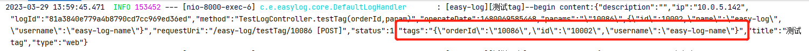
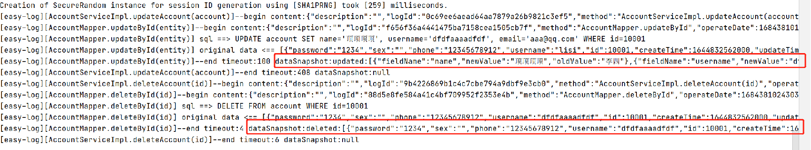
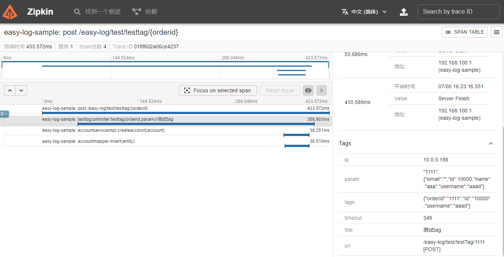

## 日志信息篇
### 默认日志信息内容

| 字段名 | 字段类型 | 注释 | 列名 | 列类型 |
| --- | ---  | ---- | ---- | --- |
| logId | String | log_id | log_id | VARCHAR  |
| type | String | 日志类型 | type | VARCHAR  |
| status | Integer | 日志状态 | status | INTEGER  |
| title | String | 日志标题 | title | VARCHAR  |
| description | String | 日志描述 | description | VARCHAR  |
| requestUri | String | URI | request_uri | VARCHAR  |
| method | String | 请求方式 | method | VARCHAR  |
| params | String | 提交参数 | params | text  |
| timeout | String | 请求时长 | timeout | VARCHAR  |
| ip | String | 请求IP | ip | VARCHAR  |
| exception | String | 异常 | exception | text  |
| operateDate | Date | 操作时间 | operate_date | TIMESTAMP  |
| operator | String | 操作人 | operator | VARCHAR  |
| traceId | String | 链路追踪ID | trace_id | VARCHAR  |
| dataSnapshot | String | 数据快照 | data_snapshot | text  |
| tags | String | 自定义属性标签 | tags | text  |

mysql参考建表语句
```sql
CREATE TABLE `log_info` (
  `log_id` varchar(32) NOT NULL,
  `type` varchar(20) DEFAULT NULL COMMENT '日志类型',
  `status` int(11) DEFAULT NULL COMMENT '日志状态',
  `title` varchar(100) DEFAULT NULL COMMENT '日志标题',
  `description` varchar(500) DEFAULT NULL COMMENT '日志描述',
  `request_uri` varchar(300) DEFAULT NULL COMMENT 'URI',
  `method` varchar(300) DEFAULT NULL COMMENT '请求方式',
  `params` text COMMENT '提交参数',
  `timeout` varchar(10) DEFAULT NULL COMMENT '请求时长',
  `ip` varchar(20) DEFAULT NULL COMMENT '请求IP',
  `exception` text COMMENT '异常',
  `operate_date` datetime(6) DEFAULT NULL COMMENT '操作时间',
  `operator` varchar(32) DEFAULT NULL COMMENT '操作人',
  `trace_id` varchar(36) DEFAULT NULL COMMENT '链路追踪ID',
  `data_snapshot` text COMMENT '数据快照',
  `tags` text COMMENT '自定义属性标签',
  PRIMARY KEY (`log_id`)
) ENGINE=InnoDB DEFAULT CHARSET=utf8;
```
### 如何自定义业务操作人
项目默认提供三种操作人获取方式,可以满足大部分使用场景. 如果依然满足不了业务需求,通过实现自定义实现OperatorProvider接口

```java
@Component
public class CustomOperatorProvider implements OperatorProvider{
    @Override
    public String currentOperator() {
        // 实现你自己的获取逻辑
        return "";
    }
}
```
> 注意! 如果自定义实现"操作人提供者",会覆盖默认SessionOperatorProvider(使用application.yaml配置提取session/header中的用户信息)
```java
@Configuration
@EnableConfigurationProperties(EasyLogProperties.class)
public class EasyLogConfiguration {
    @Bean
    @ConditionalOnMissingBean
    public OperatorProvider operatorProvider(EasyLogProperties easyLogProperties) {
        return new SessionOperatorProvider(easyLogProperties);
    }
}    
```
当然如果你了解装饰器设计模式可以避免上面事情发生,可以思考下如何实现(^_^)

### 如何使用日志标签功能
日志标签的是为了解决不同业务场景,使用者需要记录的额外业务信息。这些业务信息内容不确定,个数也不确定。这些信息可能需要被独立查询,可能在日志处理中
作为特殊的条件判断。 可能是订单Id,流水号,工单号等等。

#### 标签使用实例
标签Tag
  - key: 自定义属性标签名
  - value: 支持普通文本/spel表达式(从请求参数读取动态值)

```java
@RequestMapping("/easy-log")
@Controller
public class TestLogController {

    @Autowired
    private AccountService accountService;
    
    @EasyLog(title = "测试tag", tags = {
            @Tag(key = "orderId", value = "#orderId"),
            @Tag(key = "username", value = "#param.username"),
            @Tag(key = "id", value = "#param.id")
    })
    @PostMapping("testTag/{orderId}")
    public ResponseEntity<Map<String, Object>> testTag(@PathVariable String orderId, @RequestBody Account param) {
        Map<String, Object> result = new HashMap<>();
        result.put("data", param);
        result.put("orderId", orderId);
        accountService.createAccount(param);
        return ResponseEntity.ok(result);
    }
}
```
- 效果:自定义标签以json字符串方式保存到日志tags字段里



## 日志处理篇
### 如何控制日志处理同步还是异步
日志处理同步/异步是指处理日志任务时候使用同一个线程处理还是独立启动一个线程处理日志。那么,这两种处理业务上有什么差异呢？

- 同步处理
  - 优点: 和业务方法使用同一个线程执行,如果业务方法开启了事务,能够保证日志处理和业务一起成功或者失败
  - 缺点: 因为同一个线程执行,首先会导致业务请求执行时间变长。另外在事务场景下,日志处理异常会导致正常业务操作回滚
- 异步处理
  - 优点: 执行速度快,无论执行业务后的日志是否处理成功,都不会影响到业务方法的执行
  - 缺点: 因此存在业务执行成功后,日志万一处理失败,比如发送mq的故障,数据库故障.导致丢失审计日志  

通过上面分析,单一的同步与异步都不是完美解决方案。应该提供具体业务场景具体处理机制。

#### 日志方法控制
通过@EasyLog的handleMode属性可以控制该方法日志处理模式,默认值为:HandleMode.GLOBAL使用系统全局设置

- 异步
```java
@EasyLog(title = "使用异步记录", handleMode = HandleMode.ASYNC)
```
- 同步
```java
@EasyLog(title = "使用同步记录", handleMode = HandleMode.SYNC)
```
- 使用全局默认
```java
@EasyLog(title = "使用全局默认记录", handleMode = HandleMode.GLOBAL)
```

#### 全局默认配置
全局默认配置可以设置系统偏好。当不指定handleMode属性值或者handleMode = HandleMode.GLOBAL生效
```yaml
spring:
  easy-log:
    async: false #是否默认异步处理日志 默认:false
```

### 如何配置日志异步处理线程
异步处理线程池可以根据需要配置(若无特殊需要按默认即可)
```yaml
spring:
  easy-log:
    task:
      core-pool-size: 4 #最小可以同时运行的线程数量 默认:4
      max-pool-size: 20 #当队列中存放的任务达到队列容量的时候，当前可以同时运行的线程数量变为最大线程数 默认:20
      queue-capacity: 50 #任务队列，被提交但尚未被执行的任务
      keep-alive-seconds: 1800 #当线程池中的线程数量大于 corePoolSize 的时候，如果这时没有新的任务提交，核心线程外的线程不会立即销毁，而是会等待，直到等待的时间超过了 keepAliveTime才会被回收销毁
      thread-name-prefix: easy-log- #线程名称前缀
```

### 如何自定义和使用不同的日志处理器
在快速开始模块已经演示,自定义日志继承默认并替换默认日志处理器
```java
@Component("easyLogDataHandler")
public class H2DataHandler extends DefaultLogHandler {

    @Autowired
    private LogMapper logMapper;
    
    @Override
    public void after(LogInfo info, Method method, Class<?> targetClass, Object returnValue) {
        logMapper.insert(info);
    }
}
```
但是不同业务处理,重要性可能不同。比如查询方法请求量太大没啥好记的,输出控制台就好了。写入性质业务才记录。重要业务方法写入数据库,或者公司有统一组件收集汇总,发mq就好,那么如何控制
不同日志不同处理。后处理方法(after)不是有LogInfo和Method还有targetClass,拿过来if else一下就好。可以用,但是不够优雅。团队研发成员无法直观判断某个日志记录点是如何处理日志的。

推荐的做法
1. 继承DefaultLogHandler或者实现LogDataHandler接口,定义不同类型日志处理器
2. 在日志定义点显式指定处理器  @EasyLog(title = "测试使用H2DataHandler处理日志数据", handler = "日志处理器名称(beanName)")

#### 自定义日志处理器
```java
/**
 * 测试数据库处理日志数据
 */
@Component
public class H2DataHandler extends DefaultLogHandler {
    private static final Logger LOGGER = LoggerFactory.getLogger(H2DataHandler.class);

    @Autowired
    private LogMapper logMapper;

    @Override
    public void after(LogInfo info, Method method, Class<?> targetClass, Object returnValue) {
        if (LogInfo.STATUS_FINISH == info.getStatus()) {
            LOGGER.info("[easy-log][{}]--end save[H2] timeout:{}", info.getTitle(), info.getTimeout());
        } else {
            LOGGER.warn("[easy-log][{}]--end save[H2] timeout:{} exception:{}", info.getTitle(), info.getTimeout(), info.getException());
        }
        logMapper.insert(info);
    }
}
```

#### 在日志中显式指定处理器
```java
@RequestMapping("/easy-log")
@Controller
public class TestLogController {
    
    @EasyLog(title = "测试使用H2DataHandler处理日志数据", handler = "h2DataHandler")
    @PostMapping("testH2DataHandler")
    public ResponseEntity<Map<String, Object>> testH2DataHandler(@RequestBody AccountParam param) {
        Map<String, Object> result = new HashMap<>();
        result.put("data", param);
        return ResponseEntity.ok(result);
    }
}    
```
> 使用不同handler处理不同日志的模式,首先是为了符合"开闭原则", 目的是为了后续能够实现动态切换处理器预留了扩展点。


## 日志扩展篇
### 如何使用自己的日志信息对象
在大部分日志记录工具中,日志信息字段都是固定死的。使用者很难扩充自己字段,虽然有提供extro类似的字段,预留存放扩充值(easy-log的tags概念与此类似).能解决部分问题。但是在一些特殊场景还是没有独立的字段使用方便。
> easy-log在设计上保留了开放字段能力.通过继承默认的LogInfo对象,使用者可以扩充需要的字段属性,并且能够通过日志处理器设置内容

下面通过一个示例,演示如何给日志信息中添加一个test的字段,并且保存到数据库

#### 自定义日志对象
定义一个日志信息对象并继承LogInfo,保证新对象依然拥有默认的日志信息。使用参考LogInfo的建表语句补充对应数据库字段
```java
public class CustomLogInfo extends LogInfo {
    private String test;

    public String getTest() {
        return test;
    }

    public void setTest(String test) {
        this.test = test;
    }
}

```
#### 自定义日志处理器实现
实现LogDataHandler接口并设置泛型参数为新的日志类CustomLogInfo。
```java
/**
 * 自定义日志处理器处理自定义日志对象CustomLogInfo 继承默认的LogInfo
 */
@Component
public class CustomLogHandler implements LogDataHandler<CustomLogInfo> {
    private static final Logger LOGGER = LoggerFactory.getLogger(CustomLogHandler.class);
    
    @Autowired
    private CustomLogInfoMapper customLogInfoMapper;// CustomLogInfo的mybatis-plus接口实现忽略

    @Override
    public CustomLogInfo init(LogAttribute logAttribute, Method method, Object[] args, Class<?> targetClass) {
        return new CustomLogInfo();
    }

    @Override
    public void before(CustomLogInfo info, Method method, Object[] args, Class<?> targetClass, Object targetObject) {
        // 演示给新字段设置值,实际使用过程中可以从before各种入参中获取.
        info.setTest("这个扩展的字段呀");
        LOGGER.info("[easy-log][{}]--begin content:{}", info.getTitle(), JSON.toJSONString(info));
    }

    @Override
    public void after(CustomLogInfo info, Method method, Class<?> targetClass, Object returnValue) {
        if (CustomLogInfo.STATUS_FINISH == info.getStatus()) {
            LOGGER.info("[easy-log][{}]--end timeout:{}", info.getTitle(), info.getTimeout());
        } else {
            LOGGER.warn("[easy-log][{}]--end timeout:{} exception:{}", info.getTitle(), info.getTimeout(), info.getException());
        }
        this.customLogInfoMapper.insert(info);
    }
}

```

### 如何自定义日志注解标记日志

> easy-log抽象出LogAttribute日志属性接口作为日志记录点标识,任意方法能够提供日志属性描述都可以成为新的日志增强点。


LogAttributeMappingAdapter适配接口提供给使用者扩展,实现该接口的实现类即创建新的日志记录点。

```java
public interface LogAttributeMappingAdapter {

    /** 预留排序接口,用于多个日志属性适配器命中多个接口增强时候定义优先级,*/
    default int order() {
        return 10;
    }

    LogAttribute getLogAttribute(Method method, Class<?> targetClass);
}
```
框架能够提供service/controller方法能够自动实现日志记录的"魔法", 也是基于此扩张点实现了预设的日志记录。
```java
public class ControllerLogAttributeMapping implements LogAttributeMappingAdapter{

    private static final Logger LOGGER = LoggerFactory.getLogger(ControllerLogAttributeMapping.class);
    private final EasyLogProperties easyLogProperties;

    public ControllerLogAttributeMapping(EasyLogProperties easyLogProperties) {
        LOGGER.info("[easy-log]启动controller bean日志增强");
        this.easyLogProperties = easyLogProperties;
    }

    @Override
    public LogAttribute getLogAttribute(Method method, Class<?> targetClass) {
        if (isControllerPublicMethod(method, targetClass)) {
            String title = LogUtils.createDefaultTitle(method, targetClass);

            return DefaultLogAttribute.builder()
                    .title(title)
                    .async(easyLogProperties.getAsync())
                    .build();
        }
        return null;
    }


    private boolean isControllerPublicMethod(Method method, Class<?> targetClass) {
        return easyLogProperties.getScanController().getEnabled()
                && (targetClass.getAnnotation(Controller.class) != null || targetClass.getAnnotation(RestController.class) != null)
                && !Modifier.isStatic(method.getModifiers())
                && Modifier.isPublic(method.getModifiers());
    }
}
```


### 如何记录数据操作快照数据(数据修改对比,删除历史记录)
easy-log支持基于mybatis/mybatis-plus持久层框架,无任何手动编码自动记录修改和删除数据的快照数据,分析字段变化数据


- 添加maven依赖

```xml
        <!--mybatis-plus记录操作的数据变化模块-->
        <dependency>
            <groupId>io.github.easycode8</groupId>
            <artifactId>easy-log-data-mybatis-plus</artifactId>
            <version>latest</version>
        </dependency>
```
- 开启mybatis-plus mapper扫描

```yaml
spring:
  easy-log:
    scan-mybatis-plus:
      enabled: true #是否记录mybatis-plus的mapper日志 默认:false
```
mybatis-plus目前支持自动记录修改接口有两种
```java
        // 修改方式1: mybatis-plus提供updateById方法, 根据主键Id更新对象(可以是联合主键)
        accountMapper.updateById(account);
        // 修改方式2: mybatis-plus提供update方法,修改数据和查询对象分离
        accountMapper.update(account, Wrappers.<Account>lambdaQuery().eq(Account::getId, account.getId()));
```
mybatis目前支持自动记录快照支持按实体修改
```java
        //AccountMapper.xml中自定义方法updateByPrimaryKey, 入参为对象
        accountMapper.updateByPrimaryKey(account);
```
- 修改效果dataSnapshot:updated 为被修改的数据
```markdown
2023-08-11 11:25:18.177  INFO [sample-service,ff13310320ab4b2cb2cbb6351b3b4865] 39192 --- [nio-8000-exec-3] c.e.e.core.handler.DefaultLogHandler     : [easy-log][AccountMapper.updateById(entity)]--begin operator:[null] param:{"email":"aaa@qq.com","id":10001,"name":"dddd"}
2023-08-11 11:25:18.208  INFO [sample-service,ff13310320ab4b2cb2cbb6351b3b4865] 39192 --- [nio-8000-exec-3] c.e.e.m.i.DataSnapshotInterceptor        : [easy-log][AccountMapper.updateById(entity)] sql ==> UPDATE account SET name='dddd', email='aaa@qq.com' WHERE id=10001
2023-08-11 11:25:18.222  INFO [sample-service,ff13310320ab4b2cb2cbb6351b3b4865] 39192 --- [nio-8000-exec-3] c.e.e.m.i.DataSnapshotInterceptor        : [easy-log][AccountMapper.updateById(entity)] original data <== [{"email":"aaa@qq.com","id":10001,"name":"李四","username":"lisi"}]
2023-08-11 11:25:18.231  INFO [sample-service,ff13310320ab4b2cb2cbb6351b3b4865] 39192 --- [nio-8000-exec-3] c.e.e.core.handler.DefaultLogHandler     : [easy-log][AccountMapper.updateById(entity)]--end timeout:54 dataSnapshot:updated:[{"fieldName":"name","newValue":"dddd","oldValue":"李四"}]
```
- 删除效果dataSnapshot:deleted 为被删除数据
```markdown
2023-08-11 11:27:00.696  INFO [sample-service,2b2b9e544c8c42768f569368f772a16e] 39192 --- [nio-8000-exec-5] c.e.e.core.handler.DefaultLogHandler     : [easy-log][AccountServiceImpl.deleteAccount(id)]--begin operator:[null] param:10001
2023-08-11 11:27:00.696  INFO [sample-service,2b2b9e544c8c42768f569368f772a16e] 39192 --- [nio-8000-exec-5] c.e.e.core.handler.DefaultLogHandler     : [easy-log][AccountMapper.deleteById(id)]--begin operator:[null] param:10001
2023-08-11 11:27:00.696  INFO [sample-service,2b2b9e544c8c42768f569368f772a16e] 39192 --- [nio-8000-exec-5] c.e.e.m.i.DataSnapshotInterceptor        : [easy-log][AccountMapper.deleteById(id)] sql ==> DELETE FROM account WHERE id=10001
2023-08-11 11:27:00.700  INFO [sample-service,2b2b9e544c8c42768f569368f772a16e] 39192 --- [nio-8000-exec-5] c.e.e.m.i.DataSnapshotInterceptor        : [easy-log][AccountMapper.deleteById(id)] original data <== [{"password":"1234","sex":"","phone":"12345678912","username":"lisi","id":10001,"createTime":1644832562000,"updateTime":1645437371000,"email":"aaa@qq.com","name":"方式4"}]
2023-08-11 11:27:00.701  INFO [sample-service,2b2b9e544c8c42768f569368f772a16e] 39192 --- [nio-8000-exec-5] c.e.e.core.handler.DefaultLogHandler     : [easy-log][AccountMapper.deleteById(id)]--end timeout:5 dataSnapshot:deleted:[{"password":"1234","sex":"","phone":"12345678912","username":"lisi","id":10001,"createTime":1644832562000,"updateTime":1645437371000,"email":"aaa@qq.com","name":"方式4"}]
2023-08-11 11:27:00.701  INFO [sample-service,2b2b9e544c8c42768f569368f772a16e] 39192 --- [nio-8000-exec-5] c.e.e.core.handler.DefaultLogHandler     : [easy-log][AccountServiceImpl.deleteAccount(id)]--end timeout:5 
```

- 效果



## 日志链路
easy-log日志信息中预留了traceId字段用来标记日志的链路信息,以便在分布式场景下将分散在多个子系统中的日志关联起来,方便排查问题.

easy-log提供基于MDC记录traceId 默认格式[xxx-service,UUID]
```markdown
2023-08-11 10:25:42.615  INFO [sample-service,478227a216a34dc2954d6ff714550df5] 37360 --- [nio-8000-exec-8] c.e.e.core.handler.DefaultLogHandler     : [easy-log][TestLogController.list(username)]--begin operator:[null] param:username=aaaaaaa
2023-08-11 10:25:42.618  INFO [sample-service,478227a216a34dc2954d6ff714550df5] 37360 --- [nio-8000-exec-8] c.e.e.core.handler.DefaultLogHandler     : [easy-log][TestLogController.list(username)]--end timeout:5 
```

也可以整合开源zipkin日志追踪,并且做了自动增强处理,使用easy-log自动生成日志信息
将可以在zipkin可视化展示。

```xml
        <!--补充zipkin 客户端-->
        <dependency>
            <groupId>org.springframework.cloud</groupId>
            <artifactId>spring-cloud-starter-zipkin</artifactId>
            <!--请自行替换与项目springboot版本适配的springcloud版本-->
            <version>${spring-cloud.version}</version>
        </dependency>
```

- 补充zipkin配置

```yaml
spring:
  zipkin:
    enabled: true
    #zipkin server的请求地址
    base-url: http://192.168.10.10:9411
```
效果:


## 集群支持
### 集群模式动态控制日志开关
默认情况下,集成easy-log-web模块支持的动态修改的日志配置,是保存在当前运行实例的内存中,如果服务同时部署多实例
存在不能同时修改配置保持数据一致的问题。因此我们提供使用redis作为集群模式配置缓存的方案来解决该问题。

参考示例

接入项目补充redis依赖
```xml
        <dependency>
            <groupId>org.springframework.boot</groupId>
            <artifactId>spring-boot-starter-data-redis</artifactId>
        </dependency>
```
配置redis连接
```yaml
spring:
  ## redis config
  redis:
    host: 127.0.0.1
    port: 6379
    password: 123456
    database: 0
```
> 注意默认使用easy-log::作为配置前缀保存,如果多个项目通用同一个redis,并且使用相同的database,推荐调整前缀,加上应用服务的名称来区分不同项目，避免配置冲突

多个项目使用一个redis,建议配置前缀为 easy-log::${spring.application.name}
```yaml
spring:
  application:
    name: xxx-service #你服务的名称
  easy-log:
    cache:
      key-prefix: easy-log::${spring.application.name}
```