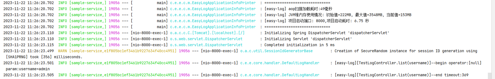
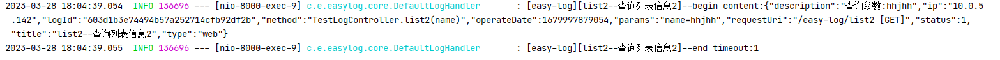
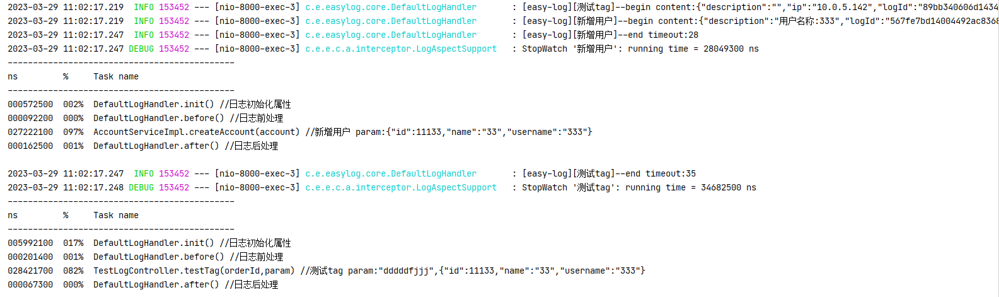
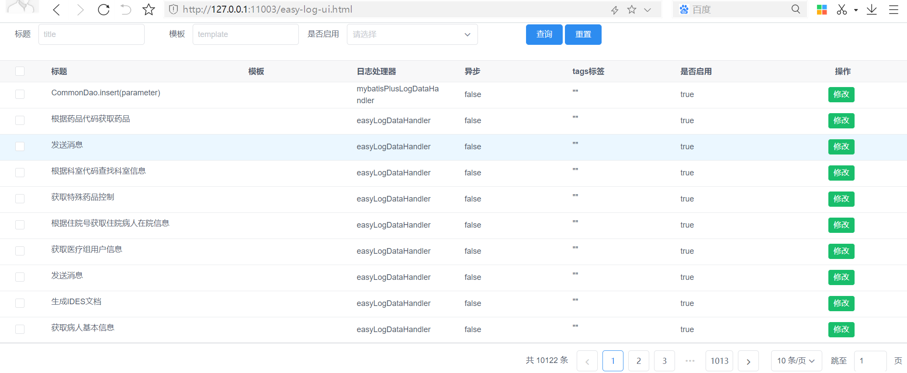
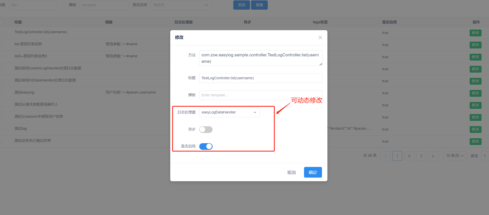

# 快速开始

## 1.引入依赖
```xml
        <dependency>
            <groupId>io.github.easycode8</groupId>
            <artifactId>easy-log-spring-boot-starter</artifactId>
            <!-- 自行替换左上角最新版本号(数字部分) -->
            <version>latest</version>
        </dependency>
```
引入依赖后默认自动装配生效,可通过配置控制开关
```yaml
spring:
  easy-log:
    enabled: true #是否启动easy-log-spring-boot-starter 默认:true
```
> easy-log基于spring aop实现功能,请确保项目已经集成并开启aop功能(spring-boot-starter-aop)
## 2.日志定义
> easy-log与传统日志注解标记业务,设计上有所不同。并不局限于指定某个日志注解增强处理,而是设计成一种开放能力。

### 方式1: 无注解记录日志
无日志注解记录操作日志,适合简单记录审计日志,不想改动业务代码,包括加日志注解也不想改的”一行不改“,极致的解耦场景。

1. 开启扫描controller日志记录配置(service同样也是支持的)

```yaml
spring:
  easy-log:
    scan-controller:
      enabled: true #是否记录controller中的公开方法 默认:false
    scan-service:
      enabled: true #是否记录service中的公开方法 默认:false
```
2. 开发一个简单的接口

```java
@RequestMapping("/easy-log")
@Controller
public class TestLogController {

    @GetMapping("/list")
    public ResponseEntity<Map<String, Object>> list(String username) {
        Map<String, Object> result = new HashMap<>();
        result.put("data", username);
        return ResponseEntity.ok(result);
    }
}    
```

3. 无日志注解记录日志效果



### 方式2: @EasyLog记录日志
@EasyLog为框架提供默认日志注用于标记需要记录日志的controller/service等接口,并且实现了定义日志处理,异步处理,自定义标签属性等高级功能

常用注解属性解释

- value/title 为日志的标题,描述接口信息
- template 使用spel表达式用于解析提取请求参数中变量用于生产日志的业务描述

1. 开发一个简单的接口并使用@EasyLog标记

```java
@RequestMapping("/easy-log")
@Controller
public class TestLogController {

    @EasyLog(value = "list-查询列表信息")
    @GetMapping("/list1")
    public ResponseEntity<Map<String, Object>> list1(String name) {
        Map<String, Object> result = new HashMap<>();
        result.put("data", name);
        return ResponseEntity.ok(result);
    }

}
```
2. @EasyLog标记接口运行效果


### 方式3: Swagger注解记录日志
大部分springboot项目都会使用swagger/knife4j来生成项目中接口文档。一般会在controller上标记@ApiOperation注解说明接口作用,
已经详细定义接口含义

1. 开发一个简单的接口并项目引入swagger/knife4j,定义@ApiOperation接口文档

```java
@RequestMapping("/easy-log")
@Controller
public class TestLogController {

    @ApiOperation(value = "list2--查询列表信息2", notes = "'查询参数:' + #name")
    @GetMapping("/list2")
    public ResponseEntity<Map<String, Object>> list2(String name) {
        Map<String, Object> result = new HashMap<>();
        result.put("data", name);
        return ResponseEntity.ok(result);
    }
}    
```

这时候再使用@EasyLog日志注解.显得累赘。开启如下配置自动将swagger的@ApiOperation注解转换成日志注解
```yaml
spring:
  easy-log:
    scan-swagger:
      enabled: true #开启swagger注解标识日志接口 默认false
```
2. 运行效果



这样引入框架后,业务代码无需改造即可实现日志增强
## 3. 配置操作人
目前提供了三种方式获取当前用户信息

|方式|说明|使用场景|
|---|---|---|
|session|通过session获取登录的用户信息,配置实现|适合用户登录场景|
|header|通过请求头获取,配置实现|适合无会话场景|
|param|接口请求参数获取,注解使用spel表达式提取|强制从请求参数获取操作人的业务场景|

### 方式1:通过session获取用户信息
示例
```yaml
spring:
  easy-log:
    operator: SESSION.account.username
```
"SESSION."代表从session中获取用户信息,account为保存在session中对象的名称。username为业务对象的字段

- SESSION.account.username等效于获取request.getSession().setAttribute(”account“, new Account("zhangsan"));设置的用户
- SESSION.loginName等效于获取request.getSession().setAttribute(”loginName“, "zhangsan");设置的用户

### 方式2:通过请求头获取用户信息
示例
```yaml
spring:
  easy-log:
    operator: HEADER.x-username
```
"HEADER."代表从请求头中获取用户信息。x-username代表请求头中的需要读取的变量.可以替换成业务中自己定义的,如x-login-name

### 方式3:通过请求参数获取用户信息
注解operator属性使用spel表达式提取请求参数字段

```yaml
@RequestMapping("/easy-log")
@Controller
public class TestLogController {

    @EasyLog(value = "测试从请求参数查询操作人", operator = "#name")
    @GetMapping("/testReadOperator")
    public ResponseEntity<Map<String, Object>> testReadOperator(String name) {
        Map<String, Object> result = new HashMap<>();
        result.put("data", name);
        return ResponseEntity.ok(result);
    }
}
```

## 4.处理日志信息
默认的日志处理器,只是简单实现了。执行前后的日志信息打印.
```java
public class DefaultLogHandler implements LogDataHandler<LogInfo> {
    private static final Logger LOGGER = LoggerFactory.getLogger(DefaultLogHandler.class);

    public DefaultLogHandler(OperatorProvider operatorProvider) {
        super(operatorProvider);
    }

    @Override
    public void before(LogInfo info, Method method, Class<?> targetClass) {
        LOGGER.info("[easy-log][{}]--begin content:{}", info.getTitle(), JSON.toJSONString(info));
    }

    @Override
    public void after(LogInfo info, Method method, Class<?> targetClass, Object returnValue) {
        LOGGER.info("[easy-log][{}]--end timeout:{}", info.getTitle(), info.getTimeout());

    }
}
```
可以根据业务需要将日志持久化到数据库中,继承DefaultLogHandler实现自己的保存逻辑,替换默认实现
```java
@Component("easyLogDataHandler")
public class H2DataHandler extends DefaultLogHandler {

    @Autowired
    private LogMapper logMapper;
    
    @Override
    public void after(LogInfo info, Method method, Class<?> targetClass, Object returnValue) {
        logMapper.insert(info);
    }
}

```

>注意!必须使用beanName="easyLogDataHandler"才能覆盖默认的日志处理器,如果定义成其他bean名称,则是新的日志处理器。默认和自定义可以共存,具体使用
> 参考进阶使用"如何自定义和使用不同的日志处理器"模块

## 5. 日志性能
任何使用aop增加逻辑,如论是事务控制,权限注解,缓存注解还是日志记录,都会对相比无aop方法执行产生一定得性能影响,使用可能会关心使用.日志记录产生影响到底是多少,是否有量化指标。
easy集成spring stopwatch功能来记录业务方法操作及日志处理器各个环节的执行耗时分析

开启方法很简单
```yaml
logging:
  level:
    root: info
    com.easycode8.easylog.core.aop.interceptor: debug #使用log4j/logback配置同理指定拦截器为debug模式即可
```




## 6. 在线管理(非必须)
easy-log提供在线日志管理可以实现所有日志处理点的预览查询。同时还支持动态控制
- 启停控制: 指定日志处理点关闭或者开启(方法级)
- 同步异步切换: 指定日志处理点切换异步同步模式(方法级)
- 日志处理器切换: 指定日志处理点切换不同的日志处理器(方法级,让不同业务有不同日志处理,或者某个日志处理失败切换处理模式)

web管理模块不是必须,框架提供的可选包扩展包,引入easy-log-spring-boot-starter模块后补充web模块即可
```xml
        <!--日志页面管理模块(日志开关/同步异步/处理器切换)-->
        <dependency>
            <groupId>io.github.easycode8</groupId>
            <artifactId>easy-log-web</artifactId>
            <version>latest</version>
        </dependency>
```
访问: http://ip:port/easy-log-ui.html 账号密码:admin/admin123 账号密码可修改也可关闭
```yaml
spring:
  easy-log:
    web:
      enableBasicAuth: true #是否开启web访问认证, 默认true
      username: admin #默认账号
      password: admin123 #默认密码

```

预览效果

动态修改配置
